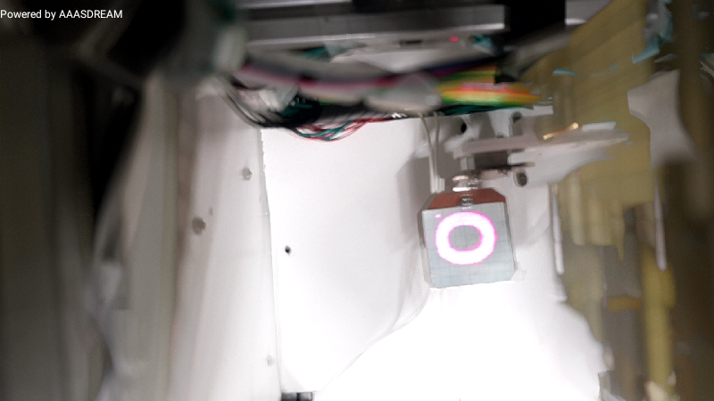
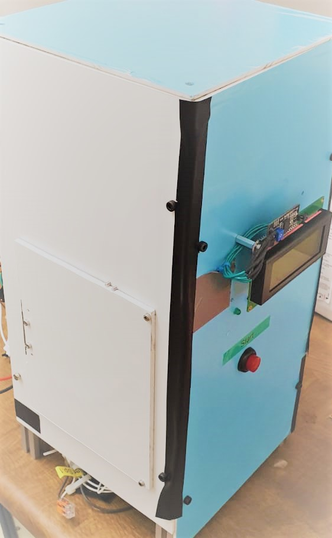

# stereolithography 3d printer

## description

SLA 3d printer was created and developped during this project.
The main goal is to print a cylindre using a resonant laser system.
in this repo you will find:
- software stack written in c on stm32 microcontroller [main](/Src/main.c)
- pcb designed with eagle [pcb](pcb_eagle/)
- documentation and contributions [report](3D Drucker_Reser12_V5.pdf)

## Picture from inside the printer 

## picture from outside the printer

## demonstartion of running

[running mp4 ideo with sound](running.mp4)

## demonstartion of printing

[printing mp4 video with sound](printing.mp4)

